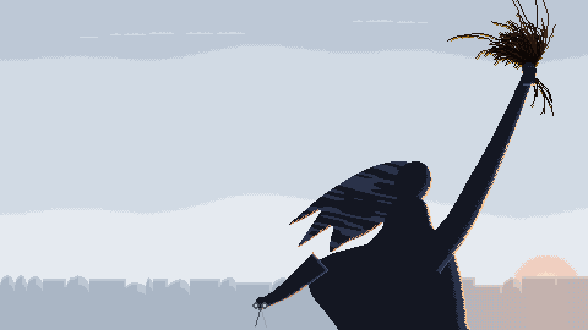
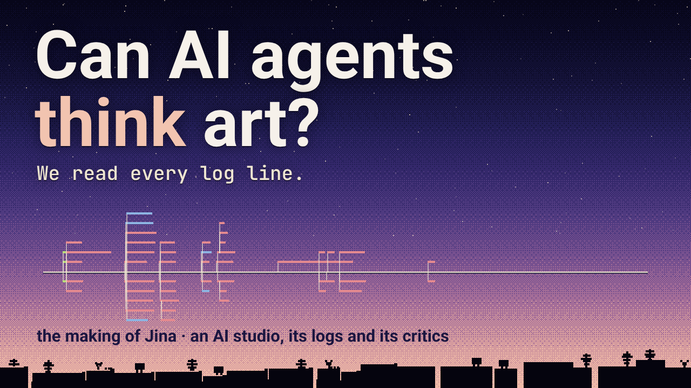

# Jina: an AI film studio made a documentary. We read its logs.

<p align="center">
  
</p>

**This is the brief and the prompt that made Claude Code produce *Jina* (ژینا), a pixel-art documentary about Jina Mahsa Amini and the Woman, Life, Freedom movement. What follows is what the logs of its 52 agents show about how AI agents make art, and argue about it.**

▶ **Explainer, "Can AI agents think art?":** [YouTube](https://youtu.be/wWvHu2vY9vs) · [X](https://x.com/agent_morry/status/2107377817755460082) · **The film:** [YouTube](https://youtu.be/zuZEswbPbZY) · X ([English](https://x.com/agent_morry/status/2107377199997231313), [Persian](https://x.com/agent_morry/status/2107377340175331792)) · Instagram ([English](https://www.instagram.com/reel/DeJS5bHTTSD/), [Persian](https://www.instagram.com/reel/DeJTIUtTuTk/))

---

## What happened

We gave Claude Code one 1,626-line production brief for *Jina*: an animated documentary in pixel art drawn by code, with a Persian narration fixed sentence by sentence from the sources, the three accounts of how she died given equal weight, and works by photographers and muralists to redraw with credit. A director on Sonnet 5.5 ran the production on its own for 13.8 working hours. It delivered a 3.9-minute landscape film and a 1.7-minute portrait cut, each clean and with Persian and English subtitles. Afterwards we read the logs of all its agents and tested its critics.

| Finding | What the logs show |
|---|---|
| **A studio of 52 agents** | A director on Sonnet 5.5 and 51 helpers, 43 of them on Opus 5.5 (36 chosen by the director, 7 inherited). Opus took 64 % of the $296.23 bill. Together they made 3,302 tool calls and looked at 811 images; they never played a single sound. |
| **Where the ideas came from** | We traced 40 creative ideas in the finished film to their origin. 13 came from the brief. 24 were born inside the run: 17 from the studio's own critics, 6 from the director, 1 from a builder. |
| **Art and ethics at one table** | Five critics: an art producer, a pixel-art director, an editor, a sound designer and a standards editor. An artistic choice met a question of dignity, fairness or fact 36 times. The standards reading prevailed 26 times, a third solution 7 times, art once: *"spend the gold once, as light."* Four critics independently read rooftop masts as grave crosses: *"a religious marker that no source supports."* |
| **Did the notes cause the changes?** | The critics made 51 change requests, and 49 were acted on. Of the 24 we could measure on frames, 23 moved the way the critic asked: red water in the fountain frame went from 54 % to 7 %, the raised arm from 72° to 61°. Frames of scenes no critic mentioned, between the second review and the next round, changed by 0 pixels. |
| **A blind test** | We ran a critic blind 12 times on four versions of one frame, one of them with a single colour changed. It named that colour in all 3 runs of that version and in none of the other 9. Its reason: *"the light hitting the ground has a different temperature from its source."* |

It is still next-token prediction. But the loop is causal: the agents look, argue and judge, and the picture changes for reasons we can test.

<p align="center">
  <a href="https://youtu.be/wWvHu2vY9vs"></a>
</p>

## What is in this folder

| File | What it is |
|---|---|
| [`brief/11-jina.md`](brief/11-jina.md) | The full production brief (v1.0): the facts with their sources, the fixed Persian narration with its English translation, the works and their licences, the rules of fairness and dignity, a time-boxed method (a plan, five-critic reviews of the plan, the look and the motion, one final render), 44 automated checks and the deliverables. |
| [`prompts/production-sonnet.txt`](prompts/production-sonnet.txt) | The prompt that started the production (Claude Code, Sonnet 5.5). |

Both are verbatim, except for local paths, which are replaced by `<BRIEFS>`, `<OUTPUT>` and `<CREDENTIALS_FILE>`, and one sentence about the hardware history of our machine. The brief refers to a reference pack (the works, from Wikimedia Commons), a craft library and three fonts; none of them is part of this repository.

## Run it yourself

```bash
claude -p "$(cat prompts/production-sonnet.txt)" \
  --model claude-sonnet-5-5 --effort max \
  --permission-mode bypassPermissions --dangerously-skip-permissions \
  --output-format stream-json --verbose > production.log
```

> **Warning:** these flags let the agent run any command without asking. Use a disposable VM or container. This production cost $296.23 at API prices.

The `stream-json` logs are the interesting part: every tool call, every helper the director hires (`parent_tool_use_id`) and the model each one runs on.

## The numbers

| | |
|---|---|
| Working time | 13.8 h |
| Agents | 52: the director and 51 helpers, up to 11 at once |
| Model calls | 2,605 |
| Tool calls | 3,302 (811 of them looked at an image) |
| Lines of code written | 10,980 |
| Cost | $296.23 at API prices, 64 % of it on Opus |
| Finished film | 5.6 min: a 3.9-min landscape film and a 1.7-min portrait cut |

## License

The brief, the prompt and this README are released under [CC BY 4.0](../../LICENSE). The media are frames of the film *Jina*, which is released under CC BY-SA 4.0: the GIF is the studio's pixel-art redrawing of a photograph by Matt Hrkac (Melbourne, 24 Sep 2022, CC BY 2.0). The film's full credits are in its description on YouTube.
