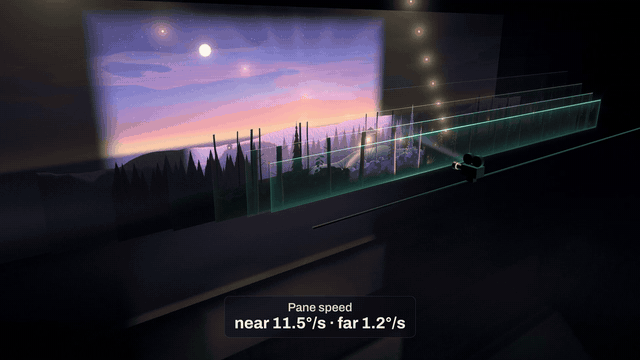

# One brief. An AI film studio.

<p align="center">
  
</p>

**These are the brief and the two prompts that made Claude Code produce a science film on its own. What follows is what its logs show about how an AI agent works when nobody is watching.**

▶ **2-minute breakdown:** [YouTube](https://youtu.be/K_hmIdawpW8) · [X](https://x.com/agent_morry/status/2106023144897036587) · **The film:** [YouTube](https://youtu.be/YeMtYLqyH88) · [X](https://x.com/agent_morry/status/2106015507745030632) · [Instagram](https://www.instagram.com/reel/Dd_n7rlTVYb/)

---

## What happened

We gave Claude Code one 1,276-line production brief for *The Multiplane Camera*. It is a short film about the camera that gave classic animation its depth: flat paintings on glass, sliding at different speeds. Sonnet 5.5 produced the film alone in 4 h 52 min. An Opus 5.5 session then spent 3 h 05 min on a finishing pass. No human input went into either session. Afterwards we read both session logs: 15,368 lines and 2,133 tool calls.

| Finding | What the logs show |
|---|---|
| **It built a studio** | 22 agents: a sound department, a QA department that spawned two workers of its own, and a panel of four art critics for every review round. At the peak, nine agents ran at once. |
| **Separation by one sentence** | The brief asked for each review "as a separate step". The agent made each critic a separate agent, sealed in its evidence folder by one sentence in its prompt. There was no sandbox. Across 994 critic actions, none opened the director's records. |
| **One parameter** | For the last review rounds it launched its critics with `model: "opus"`, spending $22.88 of the session's $158.37. Its plan, decisions and post-mortem never mention it. The logs do. |
| **Taste from the brief** | The brief offered three optional ideas. Its three creative directions were exactly those three. It read 127 of the 1,616 lines in its craft library (8 %). |
| **Eyes, but no ears** | It opened 604 images, 0 videos, and played back 0 sounds. Its own notes say: *"Nothing was auditioned by ear."* 47 % of its soundtrack's energy sits below 150 Hz: a hum. |

Every frame of the film is rendered by one WebGL2 page of raw GLSL that the agent wrote during the run. The seven paintings are procedural shaders with no image assets; the only asset file in the run is the font.

## What is in this folder

| File | What it is |
|---|---|
| [`brief/09-multiplane-camera.md`](brief/09-multiplane-camera.md) | The full production brief (v3.1): the science and its tests, the creative brief, a time-boxed method (plan, art-panel reviews of the plan, the stills and short clips, one final render), 40 automated checks and the deliverables. |
| [`prompts/1-production-sonnet.txt`](prompts/1-production-sonnet.txt) | The prompt that started the production (Claude Code, Sonnet 5.5). |
| [`prompts/2-finishing-opus.txt`](prompts/2-finishing-opus.txt) | The prompt for the finishing pass (Claude Code, Opus 5.5). It quotes the first prompt at the end. |

Everything is verbatim except local paths, which are replaced by `<BRIEFS>`, `<OUTPUT>` and `<CREDENTIALS_FILE>`. The brief refers to a reference library and a font; neither is part of this repository.

## Run it yourself

```bash
# 1. Production: Sonnet 5.5, about 5 hours
claude -p "$(cat prompts/1-production-sonnet.txt)" \
  --model claude-sonnet-5-5 --effort max \
  --permission-mode bypassPermissions --dangerously-skip-permissions \
  --output-format stream-json --verbose > production.log

# 2. Finishing pass: Opus 5.5, about 3 hours (set the run directory in the prompt first)
claude -p "$(cat prompts/2-finishing-opus.txt)" \
  --model claude-opus-5-5 --effort max \
  --permission-mode bypassPermissions --dangerously-skip-permissions \
  --output-format stream-json --verbose > finishing.log
```

> **Warning:** these flags let the agent run any command without asking. Use a disposable VM or container. The two sessions here cost $158.37 and $49.21 at API prices.

The `stream-json` logs are the interesting part. Every tool call, every spawned agent (`parent_tool_use_id`) and every model switch is in them.

## The numbers

| | Production (Sonnet 5.5) | Finishing pass (Opus 5.5) |
|---|---|---|
| Wall time | 4 h 52 min | 3 h 05 min |
| Tool calls | 1,547 | 586 |
| Agents spawned | 17 | 5 |
| Cost | $158.37 | $49.21 |

The film was delivered as a 45 s portrait cut, a 45 s square cut, a 90 s landscape cut and two 8 s loops. The published versions carry a new score composed with ElevenLabs Music. The agent's own soundtrack is the one discussed in the video.

## License

The brief and the prompts are released under [CC BY 4.0](../../LICENSE). Use them, adapt them and credit this repository.
